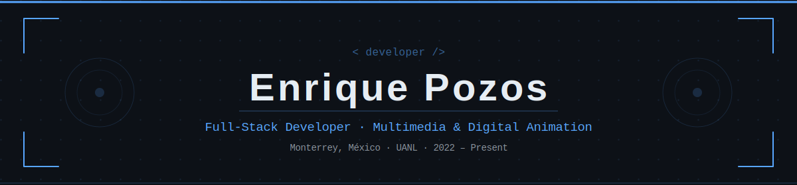

  

 

&nbsp;

---

## 👤 About Me

I'm a **Multimedia & Digital Animation** student at *Universidad Autónoma de Nuevo León*, specializing in **programming** with a strong focus on **Full-Stack** and **game/software development**.

I enjoy building everything from real-time web apps and interactive systems to desktop tools and game projects — always aiming for clean architecture and great user experience.

- 🎓 Currently studying at **UANL** (2022 – Present)
- 🌐 Experience with **MVC**, **MERN Stack**, real-time systems & NoSQL databases
- 🎮 Passionate about **game dev**, software engineering & creative tech
- 🌎 **Spanish** (native) · **English** (intermediate)

---

## 🔨 Currently Building

<table>
<tr>
<td width="60px" align="center">🌐</td>
<td>
<strong><a href="https://github.com/EnriquePozos/inclusive-reviews">Inclusive Reviews Platform</a></strong> 
A MERN Stack web app where users search and rate places based on their accessibility features. Focused on inclusive design and NoSQL data architecture.  

</td>
</tr>
</table>

---

## 🛠️ Tech Stack

**Languages**

**Frameworks & Libraries**

**Databases**

**Tools & Platforms**

---

## 🚀 Featured Projects

| Project | Description | Stack |
|---|---|---|
| [**Inclusive Reviews Platform**](https://github.com/EnriquePozos/inclusive-reviews) | Web app for searching and rating places by their accessibility features | MongoDB · Express · React · Node.js |
| [**Messaging, Video & Gamification System**](https://github.com/EnriquePozos/messaging-gamification) | Real-time chat, video calls, virtual store with in-app currency and betting pool system | React · Vite · Tailwind · PHP · MySQL · WebSockets |
| [**Recipe Blog**](https://github.com/EnriquePozos/recipe-blog) | Full-stack MVC blog with auth, posts feed and user profiles | PHP · Java · Bootstrap · MySQL |
| [**Hotel Management System**](https://github.com/EnriquePozos/hotel-management) | Desktop app for managing rooms and reservations with a transactional DB | C# · .NET · SQL Server |
| [**Payroll System with NoSQL**](https://github.com/EnriquePozos/payroll-cassandra) | Distributed payroll manager using Apache Cassandra for large-scale data | Cassandra · C# · .NET |
| [**UX/UI Web Redesign**](https://github.com/EnriquePozos/uxui-redesign) | User-centered redesign focused on navigation and interactive experience | HTML · CSS · JavaScript · Figma |

> ⚠️ **Note:** Replace each link above with your actual repository URLs.

---

## 📊 GitHub Stats

&nbsp;

  

---

  Built with ❤️ from Monterrey, México · Open to collaborations & opportunities

